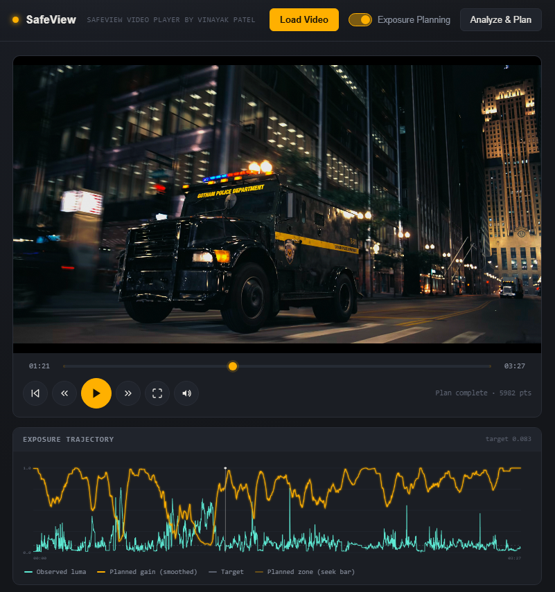
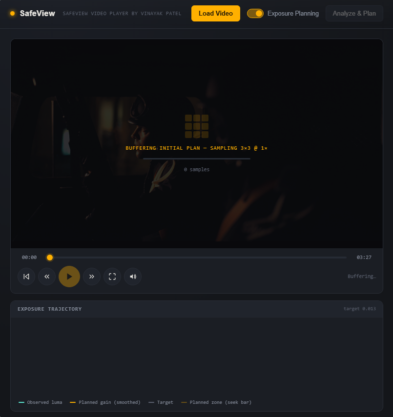
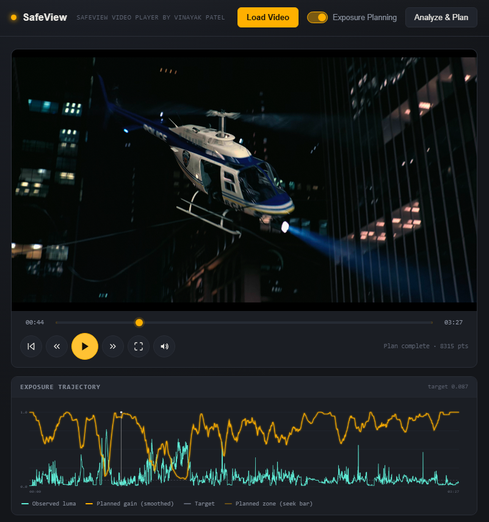
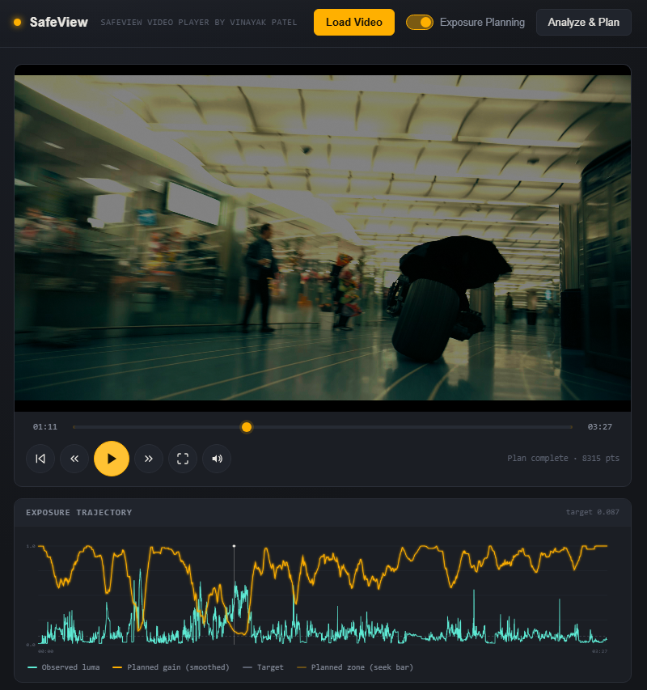
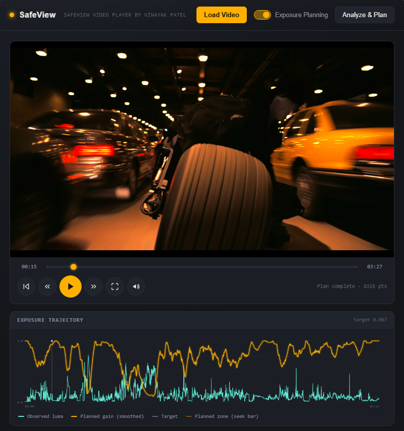

# SafeView Video Player

> High-quality browser-based video player with real-time exposure correction, GPU acceleration, image enhancement controls, and professional luminance analysis.

> Developed by **Vinayak Patel**

---

## Overview

SafeView Video Player is an advanced browser-based video player designed for viewing videos with professional image enhancement tools and intelligent exposure correction.

Unlike traditional HTML5 video players, SafeView performs real-time video processing directly inside the browser using CPU and GPU rendering pipelines. It provides exposure planning, luminance analysis, image enhancement, noise reduction, adjustable output resolution, and numerous playback controls while keeping the original video file untouched.

The project is built using pure HTML, JavaScript, CSS, Canvas, WebGL, and Web Workers without requiring external frameworks.

---

## Features

### Intelligent Exposure Planning

SafeView can analyze an entire video before playback and automatically generate an exposure correction plan.

Features include:

- Automatic luminance analysis
- Dynamic exposure adjustment over time
- Frame-by-frame exposure planning
- Smooth exposure transitions
- Configurable target luminance
- Playback buffering until sufficient analysis is completed
- Background analysis while playback continues
- Exposure trajectory visualization
- Planned gain visualization
- Live exposure statistics

---

### Real-Time Image Processing

Professional image controls available during playback:

- Exposure adjustment
- Contrast
- Saturation
- Sharpness
- Blur
- Playback speed

All processing happens in real time without modifying the original video.

---

### GPU Accelerated Rendering

SafeView includes a native GPU rendering pipeline using WebGL.

Benefits include:

- High performance rendering
- Native resolution playback
- Real-time shader processing
- Exposure correction on GPU
- Noise reduction shaders
- Image enhancement shaders
- Large resolution support

---

### CPU Rendering Mode

A CPU rendering mode is also included.

Useful for:

- Browser compatibility
- Debugging
- Lower-end hardware
- Comparing CPU vs GPU processing

---

### Professional Luminance Analysis

SafeView continuously analyzes video brightness and displays:

- Raw luminance
- Resulting luminance
- Planned gain
- Target luminance
- Samples analyzed
- Outliers excluded
- Planning progress

---

### Exposure Trajectory Graph

Visual graph displaying:

- Observed luminance
- Planned exposure gain
- Target luminance
- Playback planning frontier

This allows users to understand how exposure changes throughout the video.

---

### Advanced Noise Reduction

SafeView contains a configurable real-time noise reduction system.

Controls include:

- Enable/disable noise reduction
- Spatial denoising
- Temporal denoising
- Sigma sensitivity adjustment

The implementation attempts to preserve edges while reducing visible image noise.

---

### Film Grain / Dithering

Optional animated grain generation helps reduce visible color banding.

Adjustable parameters:

- Grain amount
- Spatial scale
- Temporal speed

---

### Adjustable Output Resolution

Render the video at different resolutions independent of the original source.

Supported presets include:

- Native source resolution
- Balanced quality mode
- Screen resolution
- 8K UHD
- 4K UHD
- 2K QHD
- 1080p
- 720p
- Custom resolution

Aspect ratio is preserved using letterboxing when necessary.

---

### Playback Controls

Complete playback interface including:

- Play / Pause
- Restart
- Skip backward
- Skip forward
- Seek bar
- Fullscreen
- Volume control
- Mute
- Playback speed adjustment

---

### Performance Optimizations

SafeView includes several performance-focused features:

- GPU rendering pipeline
- Web Workers for background analysis
- Incremental exposure planning
- Background planning while playing
- Reduced UI update mode
- Native resolution rendering
- Optimized CPU rendering mode

---

### User Interface

Modern dark interface featuring:

- Responsive layout
- Professional control panels
- Multiple configuration tabs
- Real-time statistics
- Interactive sliders
- Modern transport controls
- Exposure analysis overlay
- Status indicators

---

## Technologies Used

- HTML5
- CSS3
- JavaScript (Vanilla)
- HTML5 Canvas
- WebGL
- Web Workers
- Video API
- OffscreenCanvas

---

## Project Structure

```
SafeView/
│
├── safeview.html
├── js/
│   └── safeview.js
├── README.md
├── screenshots/
│   ├── main-interface.png
│   ├── exposure-planning.png
│   ├── sample1.png
│   ├── sample2.png
│   └── sample3.png
└── LICENSE
```

---

## Installation

Clone the repository:

```bash
git clone https://github.com/vbepipe/SafeView.git
```

Enter the project directory:

```bash
cd SafeView
```

---

## Running the Project

Start a local web server:

```bash
python -m http.server 8000
```

Open your browser and navigate to:

```
http://localhost:8000/safeview.html
```

---

## Usage

1. Launch the application.
2. Click **Load Video**.
3. Select any supported video file.
4. Optionally enable **Exposure Planning**.
5. Wait for analysis to complete or begin playback once the initial buffer is ready.
6. Adjust image enhancement settings as desired.
7. Switch between CPU and GPU rendering modes if required.
8. Monitor luminance and exposure graphs during playback.

---

## Screenshots

Screenshots will be added here.

### Main Interface



---

### Exposure Planning



---

### Samples







---

## Browser Compatibility

SafeView is designed for modern browsers supporting:

- HTML5 Video
- WebGL
- Canvas
- Web Workers
- OffscreenCanvas

Recent versions of Chrome, Edge, and other Chromium-based browsers are recommended for the best performance.

---

## License

```
////////////////////////////////////////////////////////
//
// SafeView Video Player
//
// Developer: Vinayak Patel
// Email: vinayak.chronicles@outlook.com
//
// Copyright © 2026 Vinayak Patel.
// All rights reserved.
//
// Permission is granted to individuals to use this
// software for personal, non-commercial purposes only.
//
// You may not:
//
// • Use this software commercially.
// • Modify, adapt, or create derivative works.
// • Redistribute the software or source code.
// • Sublicense or sell this software.
// • Claim authorship or remove copyright notices.
//
// Reverse engineering, decompiling, or disassembling
// this software is prohibited except where permitted
// by applicable law.
//
////////////////////////////////////////////////////////
```

---

## Author

**Vinayak Patel**

Developer of SafeView Video Player

GitHub: https://github.com/vbepipe/SafeView

Email: vinayak.chronicles@outlook.com

---

## Acknowledgements

SafeView was built as an experimental browser-based video processing application demonstrating what modern web technologies such as WebGL, HTML5 Canvas, and Web Workers can achieve for real-time video enhancement without requiring native desktop software. 

---
